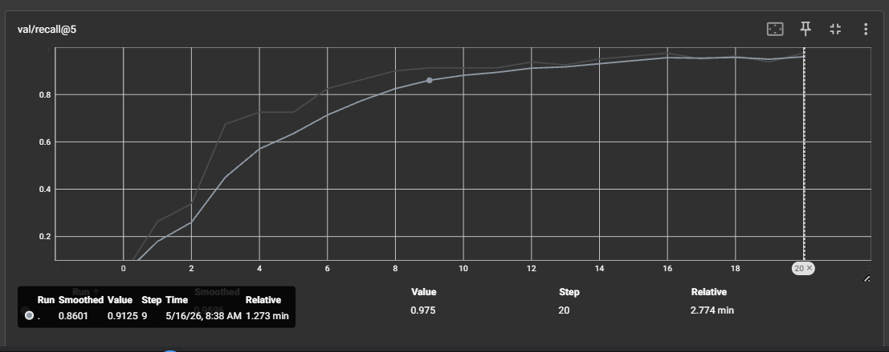
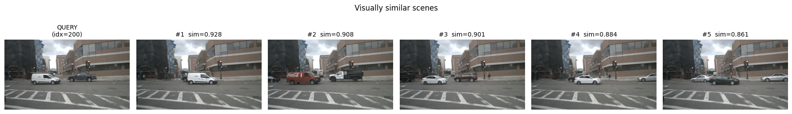
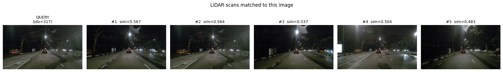
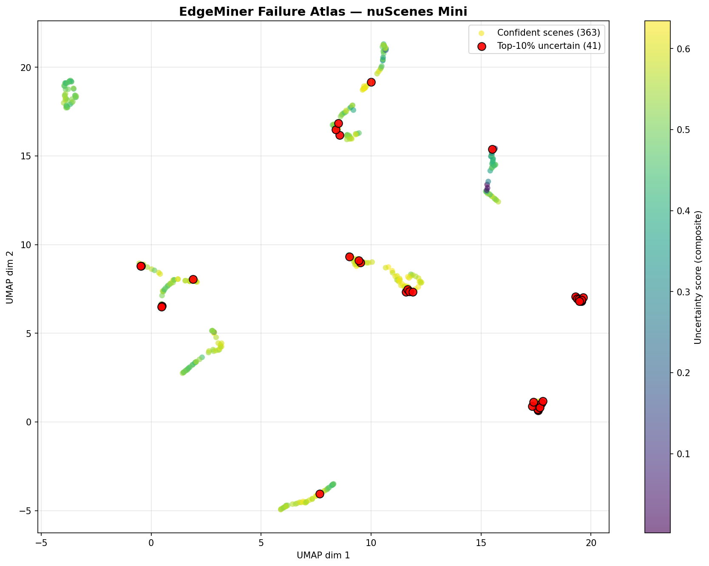
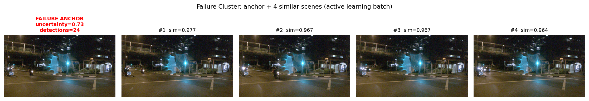

# EdgeMiner

A multimodal data mining tool for autonomous driving. Given a dataset of driving scenes, EdgeMiner finds the rare ones that are likely to break a perception model — the scenes worth labeling next.

Built on [nuScenes](https://www.nuscenes.org/), the autonomous driving dataset originally released by Motional.

---

## Why this project exists

Autonomous vehicles improve by training on the scenes their current model gets wrong. Finding those scenes is hard. Random sampling wastes labeling budget on easy cases. Manual review doesn't scale. Production teams build internal tools to solve this problem at the petabyte scale.

EdgeMiner is a small, end-to-end exploration of how those tools work: train a multimodal encoder, build a fast search index over the embeddings, score every scene by detector uncertainty, and surface the failures as labeling batches.

---

## What it does

EdgeMiner runs in three connected stages.

**1. Learn a joint embedding space.** A dual encoder is trained with contrastive learning to produce 256-dimensional embeddings of camera images and LiDAR point clouds, where matching pairs from the same scene end up close together.

**2. Search for similar scenes.** A FAISS index over the embeddings supports four query types: image-to-image, LiDAR-to-LiDAR, image-to-LiDAR, and LiDAR-to-image.

**3. Find the failures.** A pretrained YOLOv8 detector runs over the dataset. Each scene gets an uncertainty score. The most uncertain scenes are flagged, and FAISS pulls in their visually similar neighbors. The result is a set of "failure clusters" — small batches of related hard cases ready for labeling.

---

## Results

All numbers below are measured on the **nuScenes mini** split (10 scenes, 404 keyframes, 80/20 train/val split).

### Retrieval quality

The trained dual encoder lifts retrieval performance far above random chance.

| Metric | Random baseline | EdgeMiner |
|---|---|---|
| Recall@1 | 1.25% | **53.75%** |
| Recall@5 | 6.25% | **97.50%** |
| Recall@10 | 12.50% | **100.00%** |
| InfoNCE loss | 4.39 | **1.11** |

Training took 16 epochs (about 25 minutes on a single T4 GPU). The best checkpoint is saved automatically by validation Recall@5.



*Recall@5 climbs steadily from the random-baseline level (~6%) to 97.5% over 16 epochs.*

**A note on the numbers.** Mini contains many consecutive keyframes from the same drive, so retrievals often pull in temporally adjacent scenes (which is what you want — the model has learned that consecutive scenes are similar). On the full 1000-scene nuScenes split, retrieval becomes harder because there are more distractors. The results here demonstrate that the embedding space is meaningful; scaling up is part of the roadmap.

---

## Demo 1: Retrieval

Below is a query scene and its top-5 retrievals from EdgeMiner.



The model picks up adjacent keyframes from the same drive first (high similarity), then visually related scenes from elsewhere in the dataset.

### Night-scene mining

This example is more interesting because it shows the model retrieving across scenes that aren't temporally adjacent.



The query is scene 317, described in the nuScenes metadata as *"Night, big street, bus stop, high speed, construction vehicle."* All five retrievals are night-time urban driving scenes with similar lighting and road type, even though none of these features were labeled. The model learned "night driving" as a distinct cluster purely from contrastive training on paired camera and LiDAR data.

This is the workflow that matters for production data mining: given one example of a rare scenario, surface the others automatically.

---

## Demo 2: Active learning and the Failure Atlas

The retrieval system answers "find similar scenes." The active learning layer answers "find scenes the model is uncertain about, *then* find similar ones."

For each scene, EdgeMiner computes a composite uncertainty score from five signals:

- Mean detector confidence
- Minimum detector confidence
- Ratio of low-confidence detections
- Class-distribution entropy
- Whether the detector found anything at all

Scenes in the top 10% by uncertainty are flagged as failure candidates.

### The Failure Atlas

To visualize the structure of these failures, the 256-dimensional embeddings are projected into 2D with UMAP and colored by uncertainty.



Two things are visible here. First, the embedding space has structure — scenes cluster by type. Second, the high-uncertainty scenes (red) don't scatter randomly across the plot. They group together in specific regions, which means the detector's failures are **systematic**, not noise. Different regions correspond to different failure modes.

### A mined failure cluster

Here is one of the failure clusters the pipeline surfaced automatically.



The leftmost image is the anchor — a night intersection with heavy lens flare. The detector produced 24 boxes here but at low confidence (composite uncertainty score of 0.73). The four images to the right are the FAISS retrievals: visually near-identical night intersections (similarity above 0.96 for each).

This is one labeling batch. A labeler reviewing this cluster handles five related hard cases at once instead of finding each one in isolation.

Lens flare at night is a known failure mode for COCO-trained object detectors. The pipeline surfaced it without any prior knowledge that this mode existed.

---

## Why this matters

Identifying long-tail failure modes is one of the hardest problems in autonomous driving development. Production systems like Motional's Omnitag tackle this at petabyte scale. EdgeMiner is a small, public version of the same workflow, validated end-to-end on a 10-scene dataset.

---

## Production Deployment

### Inference benchmark

EdgeMiner inference is benchmarked in three modes on CPU (50 synthetic
1600×900 inputs, batch size 16). Cosine similarity to FP32 is measured
on a held-out reference image and serves as the accuracy proxy.

| Mode | Throughput (img/s) | ms/img | Speedup | Cosine sim to FP32 |
|------|-------------------:|-------:|--------:|-------------------:|
| FP32 baseline | 3.35 | 298.67 | 1.00× | 1.0000 |
| Dynamic INT8 | 4.42 | 226.42 | 1.32× | 0.7135 |
| Static INT8 | 3.71 | 269.36 | **1.11×** | **0.9993** |

### Quantization analysis

The benchmark surfaces a key tradeoff between the two quantization
strategies. **Dynamic INT8** is faster (1.32×) but degrades the embedding
quality significantly (cosine 0.71 vs FP32), making it unsuitable for
retrieval workloads. **Static INT8** with proper calibration is slower
(1.11×) but preserves cosine similarity above 0.999, retaining retrieval
quality.

For this project, static quantization is the production-ready mode.
Dynamic quantization would require additional work — narrower activation
clipping, per-layer sensitivity analysis, or QAT (quantization-aware
training) — to recover accuracy.

*Benchmark run on Colab free-tier CPU; absolute numbers will scale up
on production hardware. Relative speedups generally transfer.*

---

## Tech stack

- **PyTorch** — model training and inference
- **DINOv2** (ViT-S/14) — pretrained image encoder, frozen backbone with a trainable projection head
- **PointNet** — LiDAR encoder, trained end-to-end
- **FAISS** — exact nearest-neighbor search over embeddings
- **YOLOv8-large** (Ultralytics) — pretrained detector for uncertainty scoring
- **UMAP** — 2D projection of the embedding space
- **nuScenes devkit** — dataset loading
- **TensorBoard** — training metrics and curves

---

## Project structure

```
edgeminer/
├── src/
│   ├── data/                 # nuScenes loader
│   ├── models/               # Dual encoder (DINOv2 + PointNet)
│   ├── training/             # InfoNCE loss + training loop
│   ├── retrieval/            # Embedding extraction + FAISS index
│   └── active_learning/      # Detector + uncertainty + Failure Atlas
├── notebooks/                # End-to-end demo notebooks for each phase
│   └── figures/              # Result images used in this README
└── README.md
```

---

## Quickstart

```bash
git clone https://github.com/<your-username>/edgeminer.git
cd edgeminer
pip install -r requirements.txt
```

1. Register at [nuscenes.org](https://www.nuscenes.org/) and download `v1.0-mini.tgz` (about 3.9 GB)
2. Extract to `data/nuscenes/`
3. Run the notebooks in order: `01_explore_nuscenes.ipynb` → `02_retrieval_demo.ipynb` → `03_failure_atlas.ipynb`

Each notebook is designed to run in Google Colab with a free T4 GPU.

---

## Roadmap

- [x] Multimodal dual encoder with contrastive training
- [x] FAISS retrieval with cross-modal queries
- [x] Active learning pipeline with Failure Atlas
- [ ] FastAPI inference service with INT8 quantization
- [ ] Streamlit monitoring dashboard (embedding drift, detector confidence over time)
- [ ] Scale to full nuScenes (1000 scenes)

---

## Author

**Ameya Bhalerao** — M.S. Applied Data Science, Syracuse University.
Portfolio: [bhalerao-ameya.vercel.app](https://bhalerao-ameya.vercel.app)

## License

MIT
